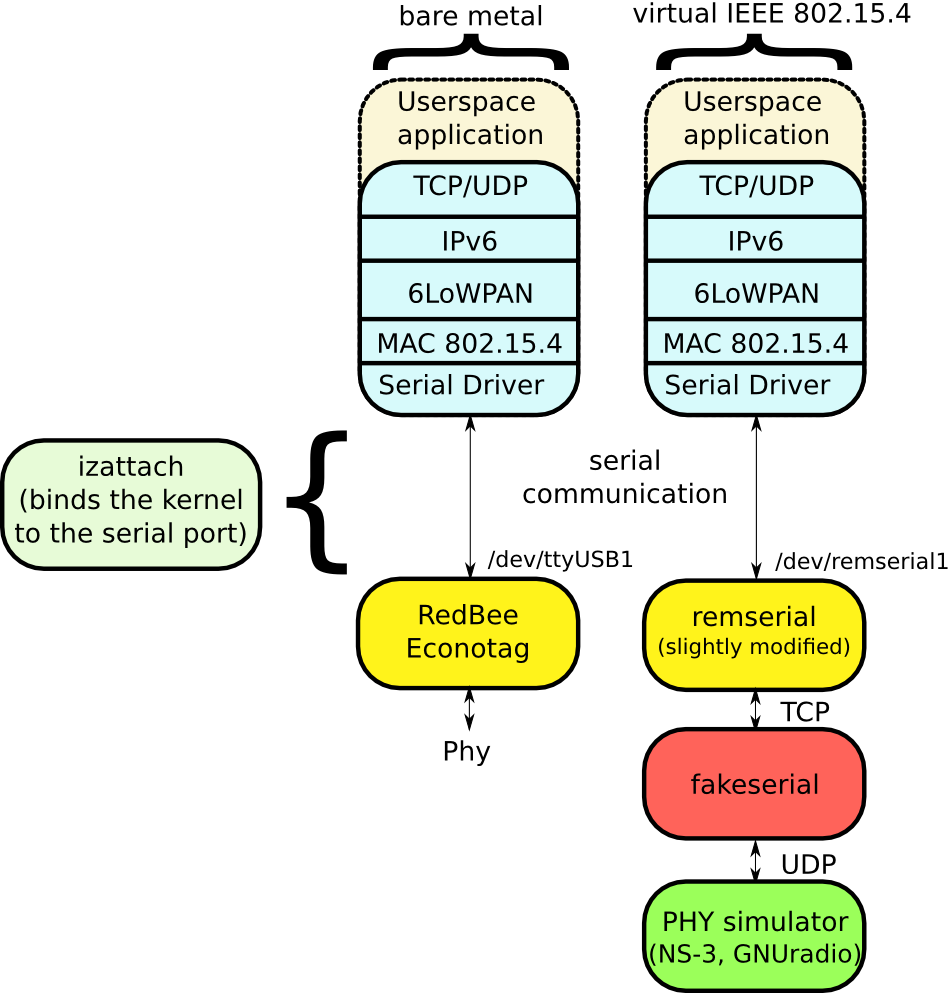

Virtual tunnel interface for the IEEE 802.15.4 serial protocol
==============================================================

What is this software about?
----------------------------

Some existing IEEE 802.15.4 devices, like the [RedBee Econotag](http://www.redwirellc.com/store/node/1)
are connected to a computer through a regular USB interface and present a
serial port to the computer in order to drive the wireless communications (left
column of the figure above). The commands that are accepted on this serial port
have been standardized and are described on the [following
link](http://sourceforge.net/apps/trac/linux-zigbee/wiki/SerialV1). On Linux,
the driver that handle this protocol and attaches to the serial port of devices
is called *serial.ko*.
A hook is userspace, named *izattach* is required in order to actually attach
the serial port to the IEEE 802.15.4 stack of the Linux kernel.
This software, named *fakeserial*, provides a replacement for a real hardware
and provides a virtual serial port for the communications (as illustrated in
the right column above). It enables new uses for the Linux IEEE 802.15.4 and
6LoWPAN stacks, such as debugging, or testbed virtualization.

It ships with *udp-broker* program that emulates a very simple wireless channel with no
packet loss.

What is the benefit of this approach?
-------------------------------------

Because we mimic the functioning of an Econotag device, one could do the following:

* connect to a simple echo-server (such as the *udp-broker*, provided with the
  sources) for debugging the 6LoWPAN stack, without having the randomness of
  real wireless communications
	* help getting familiar with the Linux 6LoWPAN stack without
	  the need of any specialized hardware
	* reliably debug the 6LoWPAN stack
* connect the 6LoWPAN stack to a network simulator, like NS-3
    * enable large scale virtualized IEEE 802.15.4 experiments
* provide valid IEEE 802.15.4 frames to GNURadio and connect a real network stack to existing physical layers.

How does it work?
-----------------

The RedBee Econotag uses a userspace tool named *izattach* to bind a serial
port to the IEEE 802.15.4 serial driver (*"serial.ko"*). Instead of binding to
the serial port presented an Econotag, we use *fakeserial* to create a fake
serial port, that redirect all the serial traffic to a UDP-enabled server that emulates the PHY layer.
For each request from the kernel, *fakeserial* analyse the protocol and emulate the functioning of a Econotag.

Dependencies
------------

* none (aside from a Linux kernel with a functional 6LoWPAN kernel and the serial driver)

Usage
-----

This program mimics the behavior of a IEEE 802.15.4 Serial device (e.g. RedBee Econotag)

	usage: ./fakeserial -d destaddr -l portnum -r portnum [-b baudrate] [-n devicename]
	-b, --baudrate: baudrate of the fake serial port (default "921600")
	-n, --device-name: name of the fake serial port (default "/dev/fakeserial0")
	-u, --udp-dest: destination address for the UDP traffic sent to the backend
	-s, --udp-local-port: local udp port to be bound
	-r, --udp-remote-port: remote UDP port to connect to and to bind locally
	-x, --delay-rx: delay before reception (from UDP socket to the kernel), in milliseconds
	-y, --delay-tx: delay before transmission (from kernel to the UDP socket), in milliseconds
	-d, --datarate: data transmission/receiption rate, in bit per seconds (default unbounded)
	-l, --latency: latency of the underlaying link, in microseconds (default 0)
	-h, --help: this help message
	-v, --version: print program version and exits

Example of usage
----------------

*fakeserial* offers network capabilities such that it can work on
different hosts. In this example, we'll use two nodes:

* *6lowpan-node*: node whose 6LoWPAN stack will be used
    - a */dev/fakeserial0* device will be created on this node using *fakeserial*
    - all the data that goes of this port is sent to *fakeserial* (running on a
    different node) using a UDP connection (destination port 3333)
* *phy-node*: a node that runs a physical layer simulation program

When you need to start the virtual IEEE 802.15.4 interface, you would need to
do the following preliminary steps.

On *6lowpan-node*:

	./fakeserial -n /dev/fakeserial0 -u phy-node -s 4444 -r 3333&

On *phy-node*:

	./udp-broker -l 3333

Then you can run the regular steps for setting up a IEEE 802.15.4 node (using
the serial driver).

Note that *6lowpan-node* and *phy-node* can be collocated on the same node.

Rate limiting (currently experimental)
--------------------------------------

This implementation attempts to provide a realistic rate limiting behavior.
This is incompatible with the other mechanism that adds delay when sending and
receiving (*-x* and *-y*)This mechanism is driving by two parameters:

* *datarate* of the virtual device: this is the data rate the device will try
  to respect
* *latency* of the link the virtual device works on: this is useful with the
  (UDP) destination of the virtual device is not local. For example, on a
  100mbps Ethernet link, this value is 0.5msec. If the virtual device and the
  PHY emulation engine are collocated on the same node, this value does not need to be set.

For example, if you want to emulate a 250kbps link over a 1ms delay link (e.g
Wifi), you can do the following:

	./fakeserial -n /dev/fakeserial0 -l 1000 -b 921600 -u 192.168.1.42 -s 4444 -r 3333 -d 250000&

About the udp-broker
--------------------

*udp-broker* is a simple UDP server that registers new clients when they first
send a packet. It then broadcasts every message it receives to all the clients
it previously registered (except the one that generated the message). Thus, it
emulates a simplistic physical layer, where there is no packet loss and no
propagation delay.

Authors
-------

* Tony Cheneau (<tony.cheneau@nist.gov> or <tony.cheneau@amnesiak.org>)

License
-------

<em>
Conditions Of Use

This software was developed by employees of the National Institute of
Standards and Technology (NIST), and others.
This software has been contributed to the public domain.
Pursuant to title 15 Untied States Code Section 105, works of NIST
employees are not subject to copyright protection in the United States
and are considered to be in the public domain.
As a result, a formal license is not needed to use this software.

This software is provided "AS IS."
NIST MAKES NO WARRANTY OF ANY KIND, EXPRESS, IMPLIED
OR STATUTORY, INCLUDING, WITHOUT LIMITATION, THE IMPLIED WARRANTY OF
MERCHANTABILITY, FITNESS FOR A PARTICULAR PURPOSE, NON-INFRINGEMENT
AND DATA ACCURACY.  NIST does not warrant or make any representations
regarding the use of the software or the results thereof, including but
not limited to the correctness, accuracy, reliability or usefulness of
this software.
</em>
