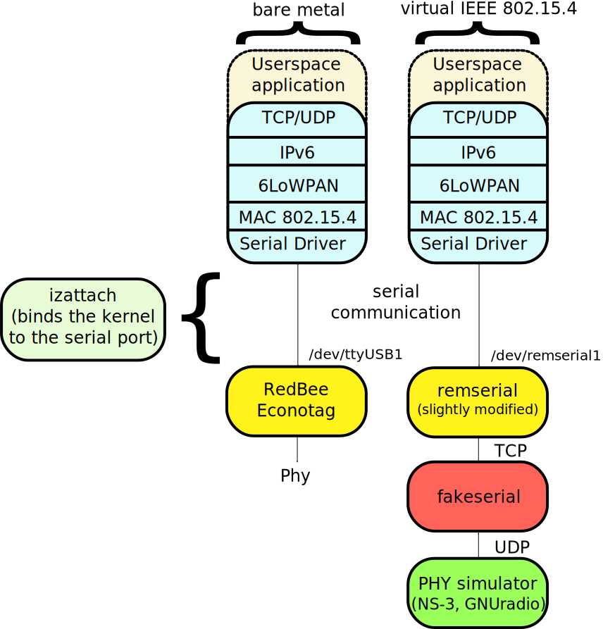

Virtual tunnel interface for the IEEE 802.15.4 serial protocol
==============================================================

What is this software about?
----------------------------

Some existing IEEE 802.15.4 devices, like the [RedBee Econotag](http://www.redwirellc.com/store/node/1)
are connected to a computer through a regular USB interface and present a
serial port to the computer in order to drive the wireless communications (left
column of the figure above). The commands that are accepted on this serial port
have been standardized and are described on the [following
link](http://sourceforge.net/apps/trac/linux-zigbee/wiki/SerialV1) On Linux,
the driver that handle this protocol and attaches to the serial port of devices
is called *serial.ko*.
A hook is userspace, named *izattach* is required in order to actually attach
the serial port to the IEEE 802.15.4 stack of the Linux kernel.
This software, named *fakeserial*, works in combination with [remserial](http://lpccomp.bc.ca/remserial/) and
provides a replacement for a real hardware and provides a virtual serial port
for the communications (as illustrated in the right column above). It enables
new uses for the Linux IEEE 802.15.4 and 6LoWPAN stacks, such as debugging,
or testbed virtualization.

What is the benefit of this approach?
-------------------------------------

Because we mimic the functioning of an Econotag device, one could do the following:

* connect to a simple echo-server for debugging the 6LoWPAN stack, without
  having the randomness of real wireless communications
	* help getting familiar with the Linux 6LoWPAN stack without
	  the need of any specialized hardware
	* reliably debug the 6LoWPAN stack
* connect the 6LoWPAN stack to a network simulator, like NS-3
    * enable large scale virtualized IEEE 802.15.4 experiments
* feed valid IEEE 802.15.4 frame to GNURadio and provide a real network stack for existing physical layers.

How does it work?
-----------------

The RedBee Econotag uses a userspace tool named *izattach* to bind a serial
port to the IEEE 802.15.4 serial driver (*"serial.ko"*). Instead of binding to
the serial port presented an Econotag, we use *remserial* to create a fake
serial port, that redirect all the serial traffic through *fakeserial*.
*fakeserial* then analyse the protocol and emulate the functioning of a Econotag.

Dependencies
------------

* [remserial](http://lpccomp.bc.ca/remserial/) (needs to be patched to work at faster baudrate)

Usage
-----

This program mimics the behavior of a IEEE 802.15.4 Serial device (e.g. RedBee Econotag)

	usage: ./fakeserial -t portnum -d destaddr -l portnum -r portnum
	-t, --tcp-local: local TCP port to be bound
	-d, --udp-dest: destination address for the UDP traffic sent to the backend
	-l, --udp-local-port: local udp port to be bound
	-r, --udp-remote-port: remote UDP port to connect to and to bind locally
	-h, --help: this help message
	-v, --version: print program version and exits

Example of usage
----------------

Both *remserial* and *fakeserial* offer network capabilities and can work on
different hosts. In this example, we'll use three nodes:

* *6lowpan-node*: node whose 6LoWPAN stack will be used
    - a */dev/remserial1* device will be created on this node using *remserial*
    - all the data that goes of this port is sent to *fakeserial* (running on a
    different node) using a TCP connection (destination port 4444)
* *relay-node*: node that receives all the serial traffic and runs *fakeserial*
    - all the traffic from *6lowpan-node* is encapsulated/decapsulated in *fakeserial*
    - this traffic is then sent to *phy-node* using a UDP connection (source port
    4444, destination port 3333)
* *phy-node*: a node that runs a physical layer simulation program

When you need to start the virtual IEEE 802.15.4 interface, you would need to
do the following preliminary steps.

On *6lowpan-node*:

	remserial -s 921600 -r relay-node -p 4444 -l /dev/remserial1 /dev/ptmx

On *relay-node*:

	./fakeserial -t 4444 -d phy-node -l 4444 -r 3333

Then you can run the regular steps for setting up a IEEE 802.15.4 node (using
the serial driver).

Note that *6lowpan-node*, *relay-node* and *phy-node* can be collocated on the
same node.

Authors
-------

* Tony Cheneau (<tony.cheneau@nist.gov> or <tony.cheneau@amnesiak.org>)

License
-------

<em>
Conditions Of Use

This software was developed by employees of the National Institute of
Standards and Technology (NIST), and others.
This software has been contributed to the public domain.
Pursuant to title 15 Untied States Code Section 105, works of NIST
employees are not subject to copyright protection in the United States
and are considered to be in the public domain.
As a result, a formal license is not needed to use this software.

This software is provided "AS IS."
NIST MAKES NO WARRANTY OF ANY KIND, EXPRESS, IMPLIED
OR STATUTORY, INCLUDING, WITHOUT LIMITATION, THE IMPLIED WARRANTY OF
MERCHANTABILITY, FITNESS FOR A PARTICULAR PURPOSE, NON-INFRINGEMENT
AND DATA ACCURACY.  NIST does not warrant or make any representations
regarding the use of the software or the results thereof, including but
not limited to the correctness, accuracy, reliability or usefulness of
this software.
</em>
